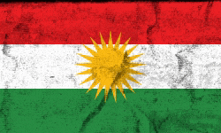
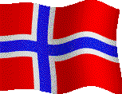

# Hi, There I'm Alan  !!

#### Email: ab@kodee.no

## Who is Alan?

I’m Alan, 27 years old, originally Kurdish  from Syria. I have a deep passion for various things. Currently, I live on the west coast of Norway . 
<a href="https://www.kodee.no/">Find more about me</a>

If you are interested in my work and want me to create the front-end of your company, please visit <a href="https://kodee.no">kodee.no</a>.

### I'm

- a junior front-end developer studying at Noroff 👩‍💻
- an art lover 🎨 and a hard worker 🏋️‍♂️🧩

## Skills

 

## Latest Projects

1. **Mentally Ill Gamers (Blog)**  
   A blog focused on gaming and mental health.  
   [View on GitHub](https://github.com/AHB-7/blog.git)

2. **Community Science Museum (Website)**  
   A child and teacher-friendly website designed for a science museum.  
   [View on GitHub](https://github.com/AHB-7/Community-Science-Museum.git)

3. **E-Com with React and TypeScript (Online Store)**  
   An e-commerce platform built using React and TypeScript.  
   [View on GitHub](https://github.com/AHB-7/e-com.git)

4. **Tarbush (Restaurant Website)**  
   A restaurant website in Trondheim, Norway.  
   [View on GitHub](https://github.com/AHB-7/tarbush)

5. **Auction Website**  
   An auction website where users can buy and sell products.  
   [View on GitHub](https://github.com/AHB-7/auctionIt)

These projects were produced during my studies at Noroff, marking my entry into the world of front-end development. Each project utilized HTML, CSS, JavaScript, TypeScript, React, and other technologies, giving me hands-on experience.

## My Passions

- I adore cuddling with my cat 🐱
- Painting 🎨
- Gaming 🕹️
- Reading 📚
- Movies 🎬
- Photography 📷

 
 

### VISITORS COUNTER

